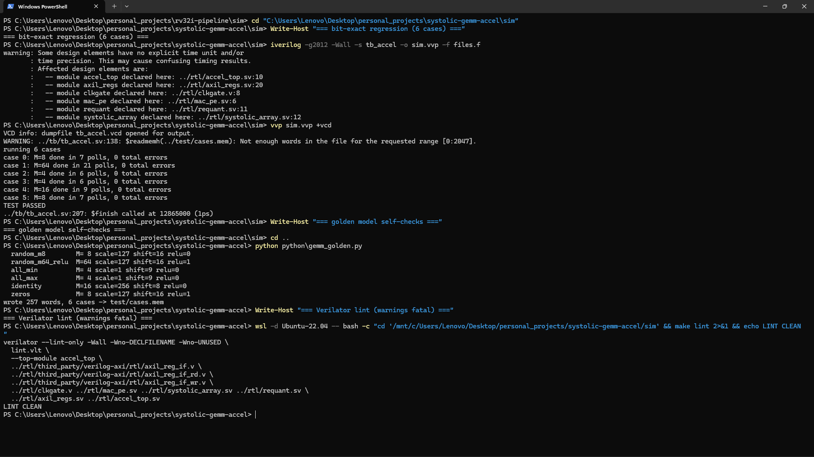
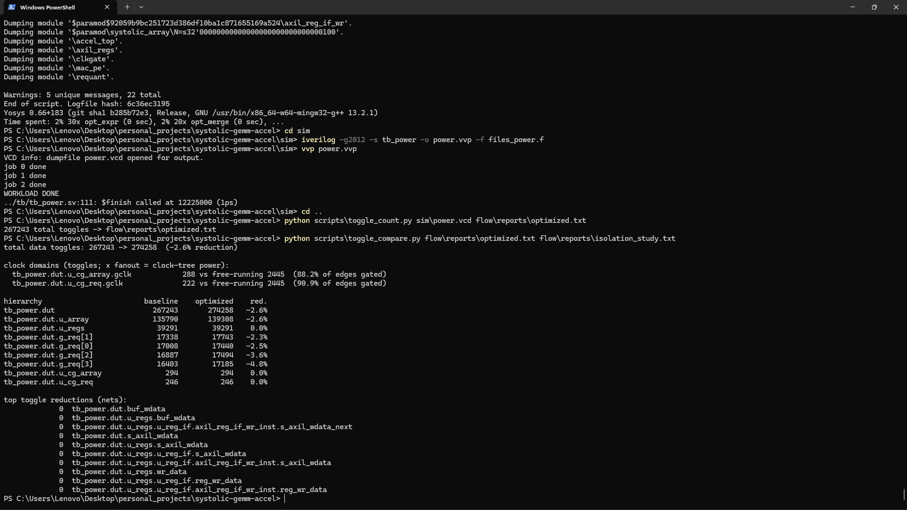
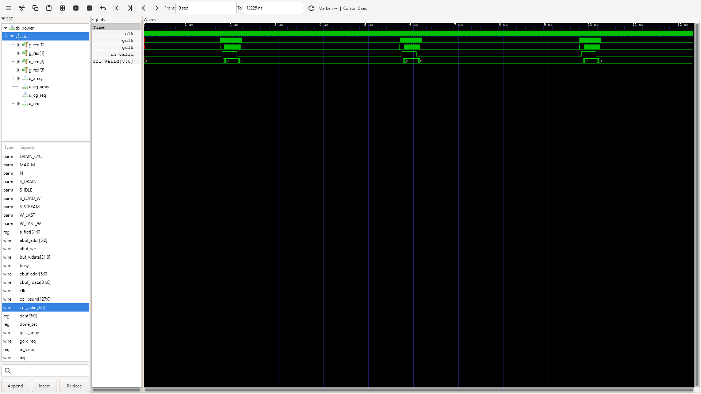

# INT8 systolic-array GEMM accelerator (SystemVerilog)

A 4x4 weight-stationary systolic-array matrix-multiply accelerator: INT8
inputs, INT32 accumulation, and a requantize (scale / shift / ReLU / saturate)
output stage, configured and fed through an AXI4-Lite register and buffer
interface. CI checks it against a bit-exact Python golden model.


## Demo

Bit-exact regression across the six cases, the golden model's own self-checks, and
Verilator lint.



Low-power measurement: 88.2% of array clock edges and 90.9% of requant clock edges
eliminated, and the measured −2.6% operand-isolation result.



Clock gating in GTKWave: three bursts of gated-clock activity (the three GEMM jobs)
separated by idle gaps while the free-running clock never stops.



## How it works

```
                 AXI4-Lite
                     │
      ┌──────────────┼──────────────────┐
      │  regs: CTRL STATUS M SCALE ...  │
      │  B buffer (4x32)  A buffer (64x32)
      └──────┬───────────────┬──────────┘
             │ LOAD_W        │ STREAM (1 A row/cycle, skewed)
             ▼               ▼
        ┌─────────────────────────┐      psums cascade down columns
        │  4x4 mac_pe mesh        │
        │  B[r][c] stationary     │──▶ col c: C[m][c] after N+c cycles
        └─────────────────────────┘
             │ per-column
             ▼
        requant: (acc*scale)>>>shift, ReLU, sat8  ──▶  C buffer (64x32)
```

Dataflow (weight-stationary): `B[r][c]` is preloaded into `PE(r,c)`. A rows
stream in from the left; row `r` of the array receives `A[m][r]` delayed by `r`
cycles (skew registers). Partial sums cascade down each column, so the bottom
of column `c` emits `C[m][c] = Σk A[m][k]·B[k][c]` exactly `N+c` cycles after
row `m` enters.

FSM: `IDLE → LOAD_W (4 cycles) → STREAM (M cycles) → DRAIN → IDLE`, with
`STATUS.done` set (and an optional `irq`) at completion.

Requantize: `q = sat8( relu?( (acc × scale) >>> shift ) )`, with a per-tensor
unsigned 16-bit scale, arithmetic right shift, optional ReLU, and saturation to
[−128, 127]. There's one instance per column, since columns finish on different
cycles.

### Cycle schedule (one A row `m`, presented at cycle `t`)

| cycle   | activity                                              |
|---------|-------------------------------------------------------|
| t + r + c | `PE(r,c)` multiplies `A[m][r]·B[r][c]`, adds psum from above |
| t + 4 + c | column `c` bottom psum = `C_acc[m][c]` valid        |
| t + 5 + c | requantized `C[m][c]` written to the result buffer  |

Rows are issued back-to-back, so a whole GEMM takes `4 + M + 12` cycles
(weight load + stream + drain), about `M + 16`.

## Register map (AXI4-Lite, 32-bit)

| addr  | name   | access | function                                  |
|-------|--------|--------|-------------------------------------------|
| 0x000 | CTRL   | W      | bit0: start                               |
| 0x004 | STATUS | R      | bit0: done (sticky), bit1: busy           |
| 0x008 | M      | RW     | number of A rows (1..64)                  |
| 0x00C | SCALE  | RW     | requant multiplier (unsigned 16-bit)      |
| 0x010 | SHIFT  | RW     | requant arithmetic right shift (0..31)    |
| 0x014 | CFG    | RW     | bit0: relu_en, bit1: irq_en               |
| 0x100 | +4·r   | W      | B row r, packed `{B[r][3]..B[r][0]}`      |
| 0x200 | +4·m   | W      | A row m, packed                           |
| 0x400 | +4·m   | R      | C row m, packed (after done)              |

## Tiling

The hardware computes `C = A×B` for `A: M×4`, `B: 4×4`, `M ≤ 64`. Software tiles
a larger `M×K × K×N` GEMM into 4-wide K-slices and 4-wide N-slices. Partial
INT32 accumulation across K-tiles happens in software (the accelerator
requantizes each job), so for multi-tile K the host keeps `scale=256, shift=8,
relu=0` (identity requant, saturating) and sums tiles, or simply sizes layers
to K=4. On-chip K-tile accumulation is future work.

## Layout

```
systolic-gemm-accel/
├── rtl/
│   ├── mac_pe.sv          # INT8xINT8 + INT32 PE, registered a/psum
│   ├── systolic_array.sv  # 4x4 mesh, input skew, valid pipeline
│   ├── requant.sv         # scale/shift/ReLU/sat8
│   ├── axil_regs.sv       # register map decode + buffer windows
│   ├── clkgate.v          # behavioral ICG (low-power retrofit)
│   ├── third_party/verilog-axi/   # vendored axil_reg_if (MIT)
│   └── accel_top.sv       # FSM, buffers, array, requant, result banks
├── python/gemm_golden.py  # bit-exact golden model + case generator
├── test/cases.mem         # golden stimulus/expectations (checked in)
├── tb/tb_accel.sv         # AXI4-Lite BFM + self-checking flow
└── sim/Makefile           # + lint.vlt (lint waivers)
```

## Credits

The domain logic is my own: the systolic array and its schedule, the
requantizer, the register-map decode, the FSM, the golden model, the
testbench, and the low-power retrofit. The AXI4-Lite protocol handling is
[alexforencich's verilog-axi](https://github.com/alexforencich/verilog-axi)
`axil_reg_if` (MIT), vendored under `rtl/third_party/` (the same open-source
AXI collection my AXI4-Lite UVM project regression-tests). I used a proven bus
core rather than hand-rolling the handshake, which keeps the design focused on
the datapath.

## Running it

```bash
cd sim
make            # build + run, expects "TEST PASSED"
make lint       # Verilator -Wall lint
make golden     # regenerate test/cases.mem (deterministic, stdlib only)
```

## Low-power retrofit (measured)

The repo carries a VCD-based switching-activity flow (`scripts/toggle_count.py`
and `toggle_compare.py`, on the `tb_power` workload of three GEMM jobs with
idle gaps), plus Yosys→sky130 + OpenSTA scripts in `flow/` for absolute power
numbers on Linux. Reports live in `flow/reports/`; `make power` regenerates
them.

Hierarchical clock gating (behavioral ICG, `clkgate.v`): the array is gated to
job windows, and requant + banks are gated to result windows. This removes
88.2% of array clock edges and 90.9% of requant clock edges (multiply by each
domain's flop fanout for clock-tree activity, the dominant dynamic-power term).
Data toggles are unchanged, as expected, since registers are already quiet when
their inputs are static.

Operand isolation (zeroing invalid wavefronts at the PE multipliers and
data-gating the requant input) measured negative: +2.6% data toggles. After
clock gating the garbage operands are already static, so the isolation muxes
only add window-boundary transitions. It's kept as an opt-in
(`-DLP_OPERAND_ISOLATION`, regression green in both configs).

The bit-exact regression is the data-integrity check for every low-power
commit, and the testbench asserts the ICG contract (enables move only while the
clock is low; gated edges coincide with clk edges). This is RTL activity, not
gate-level, so absolute power needs the `flow/` scripts. A raw VCD toggle count
also under-weights clock nets (one net vs its physical fanout), which is why
the clock domains are reported separately.

## Verification

`python/gemm_golden.py` implements the same integer arithmetic as the RTL
(Python's `>>` on ints is an arithmetic shift, matching `>>>`), asserts its own
analytic checks (identity-B returns A, all−128 saturates to +127), and emits
six cases: two random GEMMs, all −128, all +127, identity, zeros. The testbench
loads each case over AXI4-Lite, polls done, reads C back, and compares every
word exactly. A register write/read sanity check and a per-case timeout are
included; Verilator (`-Wall`) lints all RTL in CI.
